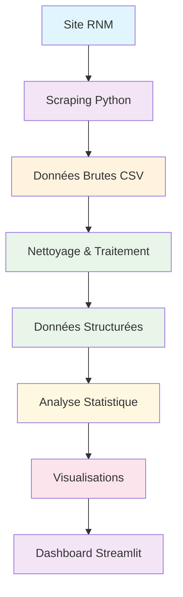

# 🥬 Dashboard Agroalimentaire - Projet de Scraping et Analyse

Un projet complet de web scraping et d'analyse de données agroalimentaires pour votre portfolio, avec dashboard interactif.

## 🎯 Objectif du projet

Ce projet démontre des compétences en **data science** et **web scraping** à travers :
- Collecte automatique de données agroalimentaires depuis le site officiel du RNM
- Nettoyage et structuration des données brutes
- Analyse statistique des tendances de prix
- Visualisations interactives avec dashboard web
- Architecture de projet professionnelle

## 📊 Source des données

**Réseau des Nouvelles des Marchés (RNM)** - FranceAgriMer
- Site officiel : [rnm.franceagrimer.fr](https://rnm.franceagrimer.fr)
- Données publiques sur les prix des produits agroalimentaires
- Mise à jour quotidienne des cotations

### Catégories de données collectées
- 🥬 **Légumes** : Tomates, carottes, salades, etc.
- 🍎 **Fruits** : Pommes, oranges, cerises, etc.
- 🥩 **Viande** : Bœuf, porc, volaille
- 🧀 **Produits laitiers** : Beurre, œufs, fromages

## 🛠️ Stack Technique

### Backend & Scraping
- **Python 3.8+** : Langage principal
- **BeautifulSoup4** : Parsing HTML
- **Requests** : Requêtes HTTP avec gestion d'erreurs
- **Fake UserAgent** : Rotation d'en-têtes HTTP
- **Pandas** : Manipulation et analyse de données
- **NumPy** : Calculs numériques

### Visualisation & Analyse
- **Plotly** : Graphiques interactifs
- **Matplotlib** : Graphiques statiques
- **Seaborn** : Visualisations statistiques avancées

### Interface Web
- **Streamlit** : Dashboard web interactif
- **HTML/CSS** : Mise en page responsive

## 📁 Structure du Projet

```
agro_data_scraping/
├── app.py                    # Application Streamlit principale
├── requirements.txt          # Dépendances Python
├── README.md                # Documentation du projet
├── src/                     # Code source modularisé
│   ├── scraper.py          # Script de scraping web
│   ├── data_processor.py   # Nettoyage et traitement des données
│   └── visualizations.py   # Génération des graphiques
├── data/                    # Données collectées et traitées
│   ├── all_agro_prices.csv     # Données brutes
│   └── processed_agro_prices.csv # Données nettoyées
├── static/                  # Fichiers statiques
│   └── plots/             # Graphiques générés
├── notebooks/              # Notebooks d'analyse (optionnel)
└── venv/                   # Environnement virtuel
```

## 🚀 Installation et Démarrage

### 1. Clonage et environnement
```bash
# Cloner le projet
git clone <repository-url>
cd agro_data_scraping

# Créer l'environnement virtuel
python -m venv venv

# Activer l'environnement
# Windows:
venv\Scripts\activate
# macOS/Linux:
source venv/bin/activate
```

### 2. Installation des dépendances
```bash
pip install -r requirements.txt
```

### 3. Exécution du projet

#### Option A : Scraping complet (recommandé)
```bash
# 1. Lancer le scraping des données
python src/scraper.py

# 2. Traiter les données collectées
python src/data_processor.py

# 3. Générer les visualisations
python src/visualizations.py

# 4. Lancer le dashboard
streamlit run app.py
```

#### Option B : Lancement rapide du dashboard
```bash
# Le dashboard inclut des fonctions de scraping intégrées
streamlit run app.py
```

### 4. Accès à l'application
Ouvrez votre navigateur et naviguez vers : `http://localhost:8501`

## 📋 Fonctionnalités du Dashboard

### 🏠 Page d'accueil
- Vue d'ensemble du projet
- Statistiques en temps réel
- Technologies utilisées

### 📊 Dashboard Principal
- **Évolution temporelle** des prix
- **Distribution** des prix par catégorie
- **Comparaisons** entre marchés et origines
- **Heatmap** interactif des prix
- **Tableau de données** filtrable et exportable

### 🔄 Page de Scraping
- Configuration du scraping
- Sélection des catégories
- Monitoring en temps réel
- Statistiques de collecte

### 📈 Analyses Détaillées
- Analyse saisonnière
- Produits les plus chers/bon marché
- Matrice de corrélation
- Tendances par marché

### ℹ️ Page À propos
- Documentation complète
- Stack technique
- Structure du projet
- Évolutions possibles

## 🔄 Workflow de Données



## 📊 Métriques et KPIs

### Données collectées
- **Fréquence** : Quotidienne (configurable)
- **Catégories** : 4+ catégories principales
- **Marchés** : 20+ marchés français
- **Produits** : 100+ références

### Analyses disponibles
- **Prix moyens** par produit et marché
- **Tendances temporelles** et saisonnières
- **Comparaisons géographiques** (origines)
- **Distribution statistique** des prix
- **Corrélations** entre variables

## 🎨 Visualisations Générées

1. **Évolution des prix** - Graphique linéaire temporel
2. **Distribution des prix** - Histogramme et boîte à moustaches
3. **Comparaison des marchés** - Barres horizontales
4. **Analyse par origine** - Graphique géographique
5. **Analyse saisonnière** - Barres groupées
6. **Heatmap des prix** - Matrice interactive
7. **Tableau de bord** - Indicateurs multiples

## 🔧 Configuration et Personnalisation

### Modification des catégories
```python
# Dans src/scraper.py
categories = {
    'Légumes': 'https://rnm.franceagrimer.fr/prix?LEGUMES',
    'Fruits': 'https://rnm.franceagrimer.fr/prix?FRUITS',
    # Ajouter vos catégories ici
}
```

### Ajustement des paramètres de scraping
```python
# Dans src/scraper.py
max_products_per_category = 10  # Limite de produits
delay_between_requests = 1      # Délai en secondes
```

### Personnalisation des visualisations
```python
# Dans src/visualizations.py
plt.style.use('seaborn-v0_8')  # Style des graphiques
sns.set_palette("husl")        # Palette de couleurs
```

## 🐛 Dépannage

### Problèmes courants

1. **Erreur de connexion**
   - Vérifiez votre connexion internet
   - Le site RNM peut être temporairement indisponible

2. **Pas de données collectées**
   - Le site peut avoir changé sa structure
   - Vérifiez les sélecteurs CSS dans `scraper.py`

3. **Dashboard ne se lance pas**
   - Vérifiez l'installation de Streamlit
   - Assurez-vous que l'environnement virtuel est activé

### Logs et monitoring
- Logs de scraping : `scraper.log`
- Console Streamlit pour les erreurs runtime
- Fichiers CSV dans le dossier `data/`

## 🚀 Déploiement

### Option 1 : Streamlit Cloud
```bash
# Créer un fichier requirements.txt
# Push sur GitHub
# Déployer sur streamlit.io
```

### Option 2 : Docker
```dockerfile
FROM python:3.9-slim
WORKDIR /app
COPY requirements.txt .
RUN pip install -r requirements.txt
COPY . .
EXPOSE 8501
CMD ["streamlit", "run", "app.py"]
```

### Option 3 : Heroku/Railway
- Configuration du Procfile
- Variables d'environnement
- Déploiement automatique

## 📈 Évolutions Possibles

### Court terme
- [ ] Ajout de plus de catégories de produits
- [ ] Système d'alertes sur variations de prix
- [ ] Export PDF des rapports

### Moyen terme
- [ ] API REST pour accès aux données
- [ ] Machine Learning pour prédiction des prix
- [ ] Intégration de données historiques

### Long terme
- [ ] Multi-sources de données
- [ ] Dashboard collaboratif
- [ ] Application mobile

## 📝 Notes Légales

- Ce projet est à **but éducatif**
- Les données proviennent de **sources publiques**
- Respect des **conditions d'utilisation** du site source
- Pas d'utilisation commerciale sans autorisation

## 👤 Contributeur

Projet développé pour démonstration de compétences en :
- Web Scraping
- Analyse de Données
- Visualisation
- Développement Web

---

**🥬 Dashboard Agroalimentaire** - Transformant les données brutes en insights pertinents pour l'industrie agroalimentaire.
